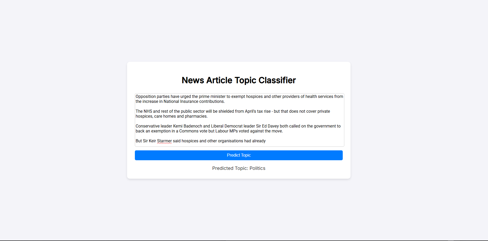

# **News Article Topic Classifier**  

A **Python** project that uses a **fine-tuned BERT (Bidirectional Encoder Representations from Transformers) model** to classify news articles into different topics. The project is built with **Flask** to provide a simple web-based interface for users to input news articles and get predictions.

# How It Works 
**Input a news article** into the text box.  

**A BERT-based deep learning model** processes the text using deep language modeling (DLM) to extract semantic meaning.  
**The predicted topic** is displayed based on the trained classification categories.  

This project utilizes **transfer learning** with BERT, an NLP model, to classify text with high accuracy. Flask is used to create a web API that allows users to interact with the model through a simple frontend.

# Preview


---

## **Setup Instructions**  

### **1. Clone the Repository or Download Project Files**  
```sh
git clone https://github.com/t1anzn/news_classifier_web_app.git
cd news_classifier_web_app
```
OR Download the code as a ZIP file:
Click the "Code" button on the repository page.
Select "Download ZIP" and extract the files.

### **2. Create a Virtual Environment (Recommended)**
To avoid dependency conflicts, it’s best to use a virtual environment:

```sh
python -m venv venv

# On macOS and Linux use:
source venv/bin/activate

# On Windows use:
venv\Scripts\activate
```

### **3. Install Dependencies**
Ensure you have Python and Flask installed along with other required packages:

```sh
pip install -r requirements.txt
```
### **4. Download the Pretrained BERT Model**
Since the BERT model is too large to be included in the repository, it must be downloaded separately.
This step is handled automatically when running the Flask app.

### **Running the Flask Application**
To start the Flask server and interact with the model:

```sh
python news_classifier_web_app/app.py
```
Once running, the web app will be accessible in your browser at:

```cpp
http://127.0.0.1:5000
```
### **Project Structure**
```
news_classifier_web_app/
│── templates/            # HTML templates
│── bert_model/           # Pretrained BERT model files
│── app.py                # Flask backend
│── requirements.txt      # Required Python packages
```

## **Technologies Used**

- **Python** - The core programming language used for backend development.
- **Flask** - Web framework for serving the model
- **BERT (Bidirectional Encoder Representations from Transformers)** - A deep learning model used for text classification.
- **HTML, CSS, JavaScript** - Frontend UI


## **Contributing**
Feel free to fork this repository and submit a pull request if you’d like to improve the project!

## License
This project is licensed under the MIT License.
This project is licensed under the MIT License.
